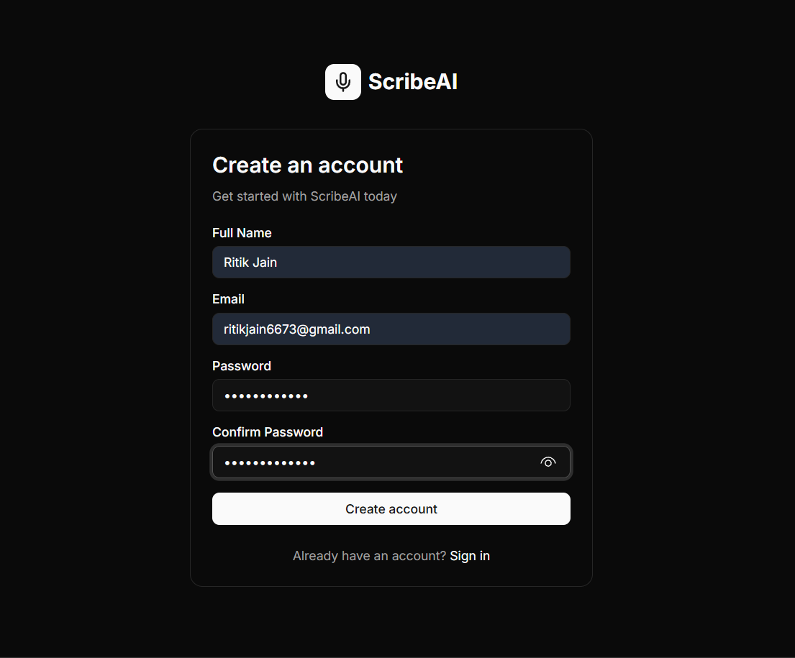
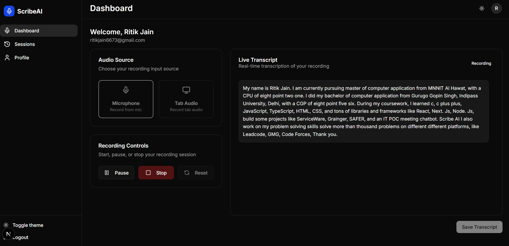
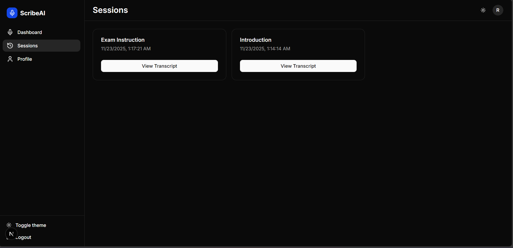
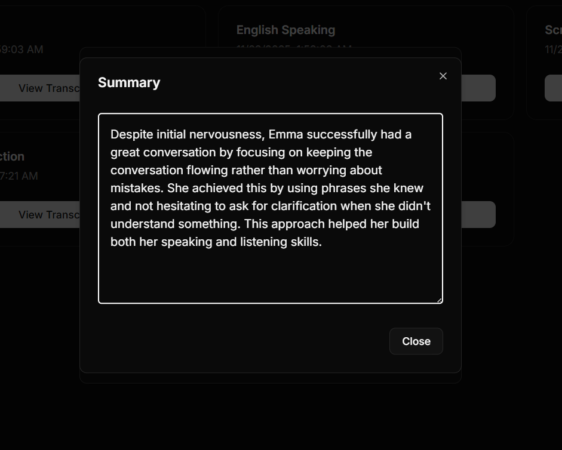

# 📝 ScribeAI

ScribeAI is a modern, **AI‑powered audio scribing and meeting transcription app** that enables users to capture **mic audio**, **tab audio**, and **generate real‑time transcription** with the power of **Gemini AI**. It offers clean UI, powerful recording features, session history, and AI‑generated summaries — making it ideal for students, working professionals, interviewees, and remote teams.


---

# 🚀 Key Features

## 🎙️ Real‑Time Recording & Transcription

* Mic audio recording
* Tab audio recording (system audio)
* Real‑time transcription via Socket.io
* Smooth transcript feed with auto-scroll
* Sessions containing all transcripts

## 🧠 AI Summary Generation (Gemini)

* Generates structured meeting summaries
* Key points
* Decisions taken
* Action items with owners
* Risks & follow-ups

## 📚 Session Management

* Past sessions listed in dashboard
* View full session transcript
* View AI summary
* Clean, card‑based UI with shadcn/ui

## 🔐 Authentication System

* Login & Signup
* Form validation
* Stores session/JWT in localStorage

## 🎨 Modern UI/UX

* Built with Tailwind + shadcn/ui
* Fully responsive
* Sidebar navigation
* Smooth typography and animations
* Dark mode support

---

# 🎥 Project Demo

```
https://drive.google.com/file/d/1mDDs-MrjtbcsTMtQ6CqwvGPlGaqI3eyQ/view?usp=sharing
```

---

## 🖼️ Screenshots










---

# 🧰 Tech Stack

| Layer                | Tech                                |
| -------------------- | ----------------------------------- |
| **Frontend**         | Next.js 14 (App Router), TypeScript |
| **UI/Styling**       | Tailwind CSS, shadcn/ui             |
| **AI**               | Gemini, Deepgram Speech‑to‑Text API |
| **Real-time**        | Socket.io Client                    |
| **State Management** | Zustand                             |
| **Recording**        | MediaRecorder API                   |
| **Deployment**       | Vercel (recommended)                |

---

# 📁 Folder Structure

```
ScribeAI/
├── app/
│   ├── login/
│   ├── signup/
│   ├── dashboard/
│   ├── sessions/
│   ├── profile
│   
│
├── components/
│   ├── AudioModeSelector.tsx
│   ├── RecordingControls.tsx
│   ├── TranscriptFeed.tsx
│   ├── Sidebar.tsx
│   └── Navbar.tsx
│
├── hooks/
│   └── useAudioRecorder.ts
│
├── lib/
│   ├── socket.ts
│   ├── utils.ts
│   └── store.ts
│
└── styles/
    └── globals.css
```

---

# 🎙️ Recording System

A modular recording engine that supports both mic & tab audio.

### 🔊 Audio Mode Selector

* Mic audio using `getUserMedia()`
* Tab audio using `getDisplayMedia()`
* Handles permission errors smoothly

### ⏺️ Recording Controls

* Start
* Pause
* Resume
* Stop
* Live status indicators

### 🔄 Streaming Logic

* MediaRecorder chunks audio every 1–2 seconds
* Sent to backend via Socket.io:

```
socket.emit("audio-chunk", blob)
```

* Live transcript updates instantly

---


# 📦 Environment Variables

Create `.env.local` in root:

```
DEEPGRAM_API_KEY=deepgram-key
DATABASE_URL=your-db-url
JWT_SECRET=your_jwt_secret
GEMINI_API_KEY=key
GEMINI_API_URL=url
```

---

# 🧪 Scripts

### 🖥️ Frontend Setup

```
cd frontend
npm install
npm run dev
```

### 🖥️ Frontend Setup

```
cd backend
npm install
prisma setup read from official docs
```


## 🙌 Made With Love By Ritik Jain

  
🔗 [LinkedIn](https://www.linkedin.com/in/ritikjain00/) | ✉️ ritikjain6673@gmail.com
